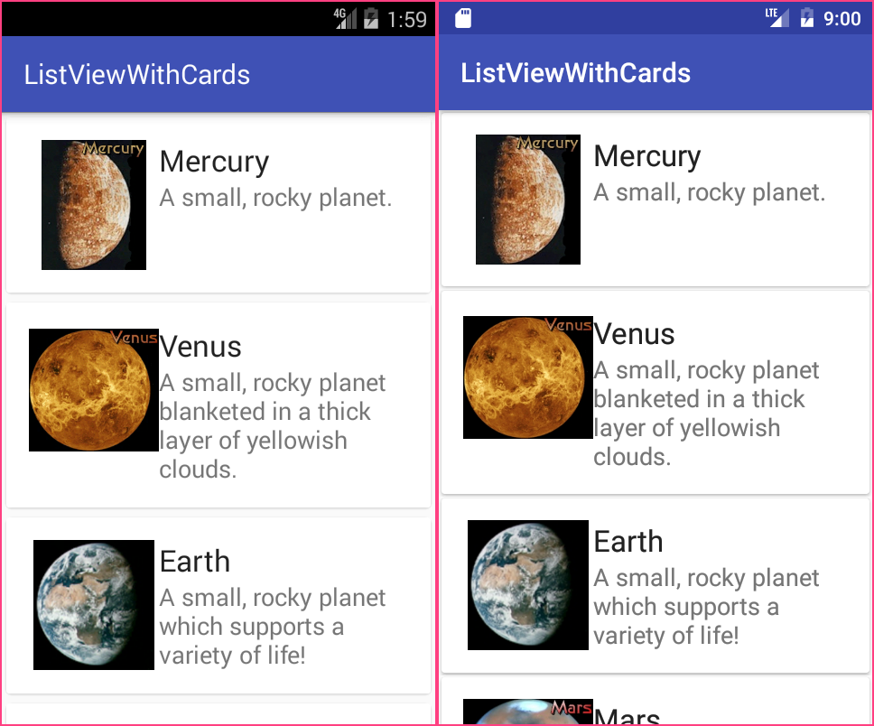

# ListView and CardView
Create lists and cards with material design styles in your apps, by using the `ListView` and `CardView` widgets.
## Screenshot

## Step by step
1. Add the Gradle dependencies to your app's module.   
 ```
dependencies {
    ...
    compile 'com.android.support:cardview-v7:24.2.1'
}
```
2. In your activity layout, add a `ListView` with a transparent divider.   
 ```
<ListView
	...
	android:divider="@android:color/transparent" />
```
3. Add your `CardView` layout to the resources.   
  1. Set the `clipToPadding` to false.   
  2. Set the vertical padding, otherwise the card elevation does not appear with API-24.   
 ```
<LinearLayout xmlns:android="http://schemas.android.com/apk/res/android"
    ...
    android:clipToPadding="false"
    android:paddingBottom="@dimen/cardview_default_elevation"
    android:paddingTop="@dimen/cardview_default_elevation">

    <android.support.v7.widget.CardView
        android:layout_width="match_parent"
        android:layout_height="wrap_content">

        <!-- Your item contents -->
    </android.support.v7.widget.CardView>
</LinearLayout>
```
4. In your activity class, setup your `ListView` and its adapter.   
 ```java
public class CardsActivity extends AppCompatActivity {
    @Override
    protected void onCreate(Bundle savedInstanceState) {
        ...

        ListView lvCards = (ListView) findViewById(R.id.list_cards);
        CardsAdapter adapter = new CardsAdapter(this);

        lvCards.setAdapter(adapter);
    }
}
```
